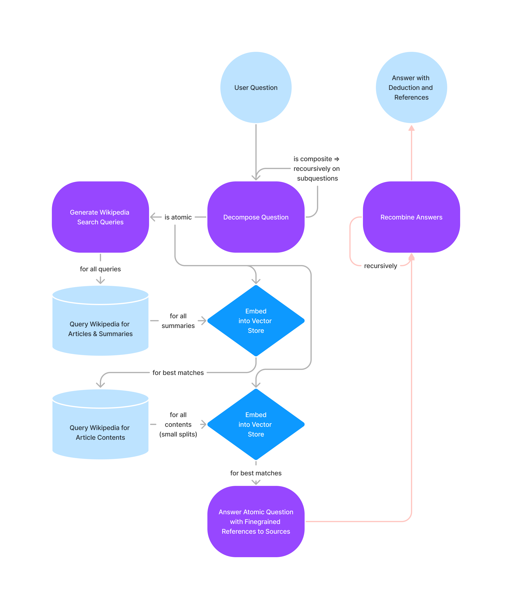

# CRAW
## a Compound Reasoning and Referencing Agent on Wikipedia using Langchain
### A project by Benjamin Eckhardt ([benjamin.eckhardt@stud.unni-goettingen.de](mailto:benjamin.eckhardt@stud.unni-goettingen.de))
#### for the Spring 2023 "Datathinking in the Era of ChatGPT" lecture by Jaan Altosaar @ University of Tartu
Editors: GPT-4, Copilot

__code repo link [github.com/beijn/project-craw](https://github.com/beijn/project-craw)__

To ___get started___ save an _OpenAI API_ key at `secret/openai_api_key`, run `pip install -r requirements.txt` (optionally in a `python -m venv venv; source venv/bin/activate`) and run `python main.py`.
There is currently no GUI. The progess will be printed to the console and the final result is a recursive tree of questions and answers, reasoning and sources.

## Overview

Language models are powerful but they are not good at reasoning nor referencing.

The core idea is that complex reasoning tasks involve nested trees of propositions and partial conclusions. Research has shown that decomposition of reasoning tasks into a 'chain of thoughts' dramatically improves the 'reasoning capabilities' of language models. And generalizing to nested 'trees of thought' improves even more dramatically [(2305.10601)](https://arxiv.org/abs/2305.10601).

Language model 'reasoning' is largely opaque and factual accuarcy questionable, as they usually do not provide references.

This project aims to build a reasoning agent that uses language models in different modular subtasks to answer questions by recursively answering subquestions. We aim to solve the intransparent 'reasoning' problem by decomposing as task into disjoint subtasks and an explanation of th reasoning behind that. Atomic subquestions are answered by connectecting a compound inference engine to Wikipedia. By collecting (only the) relevant interpretable source citations, we

The overall algorithm skelleton is hardcoded in a modular, funcionally pure way. The resulting recursive tree of questions with answers, explanations and eventually references is created elegantly as the mirror image of the algorithms pure recursion.
For replacing the static skeleton with a dynamic agent see [Future directions](#future-directions)

All interactions with LLMs work through modular, declarative and descriptive as single-purpose functions. See [LLM Interfacing](#llm-interfacing). Therefore the division in [Reasoning](#reasoning-agent) and [Referencing](#referencing-agent) is historic and aestetic.

### Reasoning Agent

- __Question Decomposition__ - Given a question decides whether the question is atomic or compound.  An ___atomic___ question will be answered by the Referencing Agent. A ___compound___ question will be decomposed into a _set of subquestions_ and a natural language _reasoning_ statements of how to combine answers to the subquestions into an answer of the given question.

- __Answer Recombination__ - Given the question, the decomposition reasoning and the recursively computed answers, compile and answer involving only reasoning and no halucinated knowledge.

### Referencing Agent

Uses multiple subsystems to find the answer to an atomic question inside a database (Wikipedia) including citations and source link.

I didn't use `langchains` convenient wikipedia api because it didn't return the full page content. Instead I collect documents manually with the standalone `wikipedia` api.

- __Search Generator__ - Takes an atomic question and generates search queries for wikipedia, to maximize the chance of finding the answer in the first few results.

- __Abstract Pre-Selector__ - Compute vector embeddings of the abstracts of the wikipedia search results and selects what is semantically related to the question.

- __Content Reference Selector__ - Computes vector embeddings of chunks of content of the related wikipedia articles and what is semantically related to the question.

- __Atomic Answerer__ - Answers the question with each related content chunk until it finds an answer.

By decomposing the task in this way we can
- _search efficiently_ - first based on abstracts to remove false search hits before we load and embed only the relevant article contexts
- _keep references_ - By starting of with articles we can keep track of the source article of the answer. By answering the queston with each related content chunk independently we can keep track of the source citation.

#### Benefits of a Vector Store
The vector store is created with `chroma` and `OpenAI` embeddings. `langchain`'s `Document`-abstraction allows to keep meta data. The meta data we keep is the source link (to the wikipedia article) and the source quotation that led to the answer.

This kind of neurosymbolic decomposition of the task allows to keep meta data intact and not to risk compromising by feeding it through a LM.

This is not the case for the common pure-LM map-reduce strategies and similar. Though `langchain` contains `Chain`s for letting the model output source references this proccess is more brittle and unrealiable if precision with references is needed. If precision with answers is more desired, reduction strategies that give the LM a larger context might help its understanding but wash away the provenance of information. See [Future Directions](#future-directions) for a note on compound solutions.

## Inspirations

- [Prompt engineering for question answering with LangChain](https://dzlab.github.io/2023/01/02/prompt-langchain/)
- [Tree of Thoughts: Deliberate Problem Solving with Large Language Models (2305.10601)](https://arxiv.org/abs/2305.10601)
    - found via [Prompt Engineering Guide](https://www.promptingguide.ai/techniques/tot)
    - [see langchain feature request](https://github.com/hwchase17/langchain/issues/4975)
- [Create a Wikipedia Question-Answering App With Python](https://betterprogramming.pub/create-a-wikipedia-question-answering-app-with-python-2401e1789d6c)

## LLM-Interfacing

LLM Interfaces are declared declaratively and descriptively with as single purpose functions with semi-structured input and structured output.

Each query is stateless and includes the whole prompt. LLM APIs are conveniently provided by `langchain`.

The prompts are generated from an instruction text, an output format specification and query data.

The output format specification is generated using langchain's pydantic integration in form of json with field descriptions. It is accompanied with an output parser for free that can conveniently parse format-adhering LLM output into a python datastructure.

The module prompt specifications are located under `queries/`

## Techstack
- **`langchain`** has suuper nice abstractions for querying LMs
- `chromadb` is used with langchain to create and query a vector store for efficiently querying related text pieces by cosine similarity of embeddings
   - the equation for cosine similarity is: (according to GPT-4):

     $\cos (\mathbf{A},\mathbf{B})= \frac{\mathbf{A} \cdot \mathbf{B}}{\|\mathbf{A}\|\|\mathbf{B}\|} = \frac{\sum_{i=1}^{n} A_i B_i}{\sqrt{\sum_{i=1}^{n} A_i^2} \sqrt{\sum_{i=1}^{n} B_i^2}}$
- ***`duckdb`*** is used in chromadb
- **`pydantic`**: enables suuuper `easy` declaration of desired structured data output format of LMs and automatic parsing in conjuction with langchain. Also is the nicest way to featurefully declare compound data structures I ever saw.

## Results

The LLM query modul `decompose` is working very well (see its `test`).

There is currently bugs in the LLM query module `answer_atomic` and `alternative` that make the model generate badly formatted, wrong or even random output. Bugfixing neural functions is annoying because you never now if the model got you and how to make it get you. Too short explanations are insuffiecent, too long ones expensive and confusing. More over models sometimes just replicate their prompt examples instead of replying properly.

The query module `wiki_queries` was improved drastically by adding more description and examples.

The current architecture is nice, but allows only very crude and limited inspection of what is happening. Improving the (currently hacky) abstractions around prompts and query modules can enable elegant tracing.

The goal of finding relevant wikipedia article parts that contain answers to the question is not very well achieved yet.

### Experiments

The unpredictability is exemplified in `example_outputs/230621-1049` where the model correctly decomposes the question, solves one part (though a bit strangely), but fails on the isomorphic second part.

The working base case is exemplified in `example_outputs/230621-1054` though the Wikpedia Article Search engine could work better and select an article on the chemical element carbon.

A pure math example in `example_outputs/230621-1100` illustrates that the decomposition is not working smartly and realiably for complex pure reasoning tasks.
Also we learn that there is obvously atomic questios that cannot be answered in Wikipedia but by eg. mathematical means. `llmchain`'s `Agent`s have access to different `Tool`s like math from which they can choose to solve a (sub)task. See [Further Directions](#llms-as-agents).

### Takeaways

__LLMs as Functions__ - We can just describe what we want the component to do and even get structured data in and out. I heard of this technique but now I had an interesting time experimenting with it. Due to extreme computational expenses this strategy should only by used when the function is not reasonable programmable (like in our case were reasoning and free form language processing is involved). But it is very interesting for rapid prototyping since you write descriptions and examples (tests) anyway.

__Copilot and Prompted Code Generation (GPT-4)__ - Suck at recursion (in the naive way I used them). Are excellent in pikking up patterns and translating (eg translate a self invented shorthand for class definitions using only part of one translation example).

## Future Directions

### LLMs as Agents

Besides the benefits argued for above and the benefit for fast development of a complex project the functional, declarative, modular apprach has a few drawbacks like engeneering of many custom prompts and possible inefficieny and imprecision due to separation of concers.

It could be feasable to join multiple subsystem one-off functions into one state keeping chat model, so that we benefit from implicit clues to achieve better reasoning.

Further one could replace the hardcoded structure of the algorithm with and agentic LLM and a description of the algorithm. `langchain` has the `Agent` abstraction for this purpose. I couldnt use the LLM Agent abstraction, because I needed to keep structured data (like sources for atomic facts) and wanted to engineer the code in a functionally pure way.
An agent is inherently imperative and unpredictable which seems to me like a chore to get working or debug (especially building interesting datastructes when its up to the model to decide what and when and the only interface is free form commands), but might in the end in fact be simpler because of looser coupling and delegation to LLMs. _I will explore this further_.
Here is a promising example conversation I head with a prompt by my self: https://chat.openai.com/share/a508ef62-a759-4999-a470-ecf8963011a8

### Merging the Benefits of Vector Stores for Source Identification and LM Reduction Strategies for Answer Quality
Maybe by first reducing the document store and then querying the preprompted model to select or rate the influence of different propositions. To avoid context length limits, each proposition would be evaluated independently in the context of the reduction. To save enormous computational ressources the vector store would be used to select only the most promising pieces of text.

### Use the nested structure of Wikipedia to navigate recursively and not just using the search tool

### Provide a user interface to visually understand the reasoning process

### Allow user intervention in the reasoning process and fact lookup. Also chat.

## Disclaimer on the Usage of Gerative AI
This blog post ist 99% human written; The code to 90% (I think because of slow internet here); and I had all ideas by my self.

## Ecological Concerns
This reasoning process is very expensive as many long queries to Large Language Models are made (`text-davinci-003`). Smaller models work less good because of high demands on structured outputs combined with complex queries. Further modularization into smaller more efficient components involving design of token efficient prompts can improve the situation. A loss in system performance is not to be expected since the current version is stateless and minimal in context in all queries anyway.
Besides uncounted emmissions by using `GPT-4` for extensive experiments, the use of `text-davinci-003` via the OpenAI API during development has generated costs of $7.57 OpenAI API credits.

## Thanks

I thank Jaan Altosaar and the One Fact Foundation for inviting so many highly inspiring guest lecturers to the Datathinking course and for granting access to software.